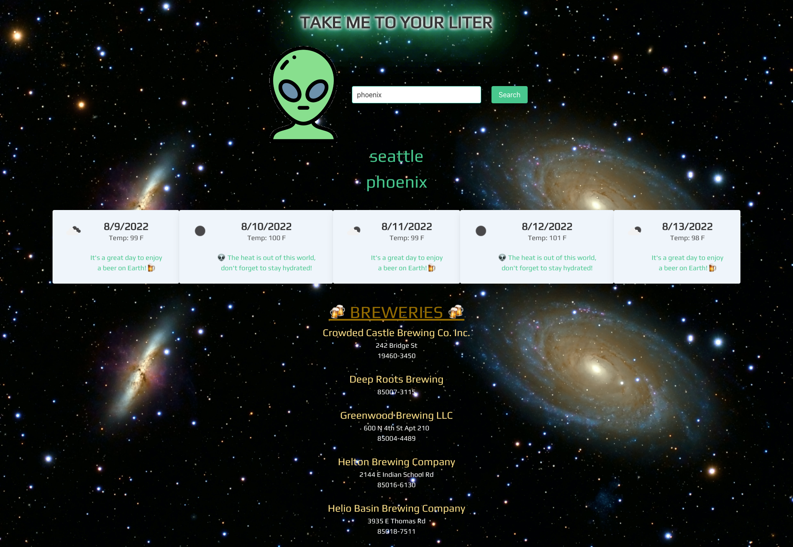

# PRJT1_Take-me-to-you-LITER

This is webpage finds a 5 day weather forecast and local breweries by city fetching two different APIs. 

I updated the  code to meet the following acceptance criteria:

Application uses at least two server-side APIs.

Application uses client-side storage to store persistent data.

Application doesn't use JS alerts, prompts, or confirms (uses modals instead).

Application uses a CSS framework other than Bootstrap.

Application is interactive (accepts and responds to user input).

Please see [live page here](https://mattg-git.github.io/PRJT1_Take-me-to-your-LITER/) and screenshot of project below.

